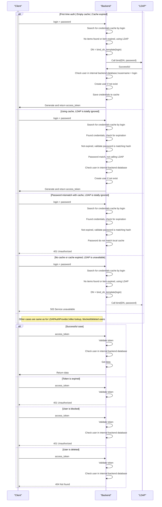

# LDAP Cached Auth provider { #backend-auth-ldap-cached }

## Description { #cached_ldap-description }

Same as [LDAP Auth provider][backend-auth-ldap-cached], but if LDAP request for checking user credentials was successful,
credentials are stored in local cache (table in internal database, in form `login` + `hash(password)` + `update timestamp`).

Next auth requests for the same login are performed against this cache **first**. LDAP requests are send *only* if cache have been expired.

This allows to:

- Bypass errors with LDAP availability, e.g. network errors
- Reduce number of requests made to LDAP.

Downsides:

- If user changed password, and cache is not expired yet, user may still log in with old credentials.
- Same if user was blocked in LDAP.

## Interaction schema { #cached_ldap-interaction-schema }

## Configuration { #cached_ldap-configuration }

Other settings are just the same as for `LDAPAuthProvider`

::: horizon.backend.settings.auth.cached_ldap.CachedLDAPAuthProviderSettings
  
::: horizon.backend.settings.auth.cached_ldap.LDAPCacheSettings

::: horizon.backend.settings.auth.cached_ldap.LDAPCachePasswordHashSettings
