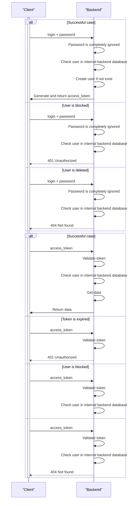

# Dummy Auth provider { #backend-auth-dummy }

## Description { #dummy-description }

This auth provider allows to sign-in with any username and password, and and then issues an access token.

After successful auth, username is saved to backend database. It is then used for creating audit records for any object change, see `changed_by` field.

## Interaction schema { #dummy-interaction-schema }

## Configuration { #dummy-configuration }

::: horizon.backend.settings.auth.dummy.DummyAuthProviderSettings

::: horizon.backend.settings.auth.jwt.JWTSettings
