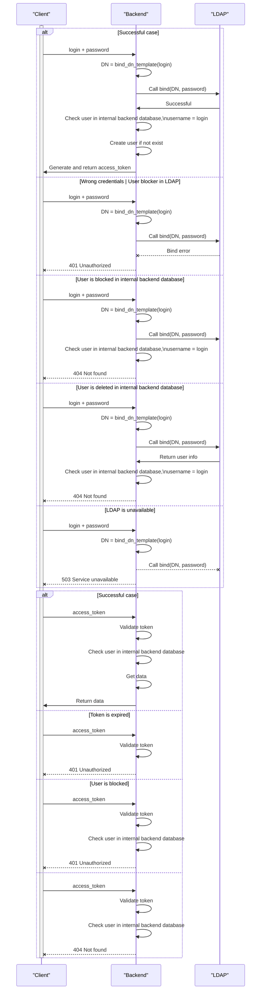

# LDAP Auth provider { #backend-auth-ldap }

## Description { #ldap-description }

This auth provider checks for user credentials in LDAP, and and then issues an access token.

All requests to backend should be made with passing this access token. If token is expired, then new auth token should be issued.

After successful auth, username is saved to backend database. It is then used for creating audit records for any object change, see `changed_by` field.

!!! warning

    Until token is valid, no requests will be made to LDAP to check if user exists and not locked. So do not set access token expiration time for too long (e.g. longer than a day).

## Strategies { #ldap-strategies }

!!! note

    Basic LDAP terminology is explained here: [LDAP Overview](https://www.zytrax.com/books/ldap/ch2/)

There are 2 strategies to check for user in LDAP:

- Try to call `bind` request in LDAP with `DN` (`DistinguishedName`) and user password. `DN` is generated using [bind_dn_template][horizon.backend.settings.auth.ldap.LDAPSettings.bind_dn_template]
- First try to *lookup* for user (`search` request) in LDAP to get user's `DN` using some query, and then try to call `bind` using this `DN`. See [lookup settings][horizon.backend.settings.auth.ldap.LDAPSettings.lookup]

By default, **lookup strategy is used**, as it can find user in a complex LDAP/ActiveDirectory environment. For example:

- search for user by `uid`, e.g. `(uid={login})` or `(sAMAccountName={login})`
- search for user by several attributes, e.g. `(|(uid={login})(mail={login}@domain.com))`
- filter for entries, like `(&(uid={login})(objectClass=person)`
- filter for users matching a specific group or some other condition, like `(&(uid={login})(memberOf=cn=MyPrettyGroup,ou=Groups,dc=mycompany,dc=com))`

After user is found in LDAP, its [uid_attribute][horizon.backend.settings.auth.ldap.LDAPSettings.uid_attribute] is used for audit records.

## Interaction schema { #ldap-interaction-schema }



```mermaid
sequenceDiagram
participant "Client"
participant "Backend"
participant "LDAP"

<<<<<<< HEAD
"Backend" ->  "LDAP" : bind(lookup.username, lookup.password)
activate "LDAP"
Note right of "LDAP" : Open connection \npool for\nsearch queries\n(optional, recommended)
=======
    "Backend" ->  "LDAP" : bind(lookup.username, lookup.password)
    activate "LDAP"
    Note right of "LDAP" : Open connection \npool for\nsearch queries\n(optional, recommended)
>>>>>>> 813adee89e7976534de25710e354a85d03cabc4a

activate "Client"
alt Successful case
"Client" ->> "Backend"  : login + password
"Backend" ->> "Backend" : query = query_template(login)
"Backend" ->> "LDAP" : Call search(query, base_dn, attributes=*)
activate "LDAP"
"LDAP" ->> "Backend" : Return user DN and uid_attribute
deactivate "LDAP"
"Backend" ->> "LDAP"  : Call bind(DN, password)
"LDAP" ->> "Backend"  : Successful
"Backend" ->> "Backend" : Check user in internal backend database,\nusername = uid_attribute from LDAP response
"Backend" ->> "Backend" : Create user if not exist
"Backend" ->> "Client"  : Generate and return access_token

else Wrong credentials | User blocker in LDAP
"Client" ->> "Backend"  : login + password
"Backend" ->> "Backend" : query = query_template(login)
"Backend" ->> "LDAP" : Call search(query, base_dn, attributes=*)
activate "LDAP"
"LDAP" ->> "Backend" : Return user DN and uid_attribute
deactivate "LDAP"
"Backend" ->> "LDAP"  : Call bind(DN, password)
"LDAP" --x "Backend"  : Bind error
"Backend" --x "Client"  : 401 Unauthorized

else User is blocked in internal backend database
"Client" ->> "Backend"  : login + password
"Backend" ->> "Backend" : query = query_template(login)
"Backend" ->> "LDAP" : Call search(query, base_dn, attributes=*)
activate "LDAP"
"LDAP" ->> "Backend" : Return user DN and uid_attribute
deactivate "LDAP"
"Backend" ->> "LDAP"  : Call bind(DN, password)
"LDAP" ->> "Backend"  : Successful
"Backend" ->> "Backend" : Check user in internal backend database,\nusername = uid_attribute from LDAP response
"Backend" --x "Client"  : 404 Not found

else User is deleted in internal backend database
"Client" ->> "Backend"  : login + password
"Backend" ->> "Backend" : query = query_template(login)
"Backend" ->> "LDAP" : Call search(query, base_dn, attributes=*)
activate "LDAP"
"LDAP" ->> "Backend" : Return user DN and uid_attribute
deactivate "LDAP"
"Backend" ->> "LDAP"  : Call bind(DN, password)
"LDAP" ->> "Backend"  : Successful
"Backend" ->> "Backend" : Check user in internal backend database,\nusername = uid_attribute from LDAP response
"Backend" --x "Client"  : 404 Not found

else LDAP is unavailable
"Client" ->> "Backend"  : login + password
"Backend" ->> "Backend" : query = query_template(login)
"Backend" --x "LDAP" : Call search(query, base_dn, attributes=*)
"Backend" --x "Client" : 503 Service unavailable
end

alt Successful case
"Client" ->> "Backend"  : access_token
"Backend" ->> "Backend" : Validate token
"Backend" ->> "Backend" : Check user in internal backend database
"Backend" ->> "Backend" : Get data
"Backend" ->> "Client"  : Return data

else Token is expired
"Client" ->> "Backend"  : access_token
"Backend" ->> "Backend" : Validate token
"Backend" --x "Client"  : 401 Unauthorized

else User is blocked
"Client" ->> "Backend"  : access_token
"Backend" ->> "Backend" : Validate token
"Backend" ->> "Backend" : Check user in internal backend database
"Backend" --x "Client"  : 401 Unauthorized

else User is deleted
"Client" ->> "Backend"  : access_token
"Backend" ->> "Backend" : Validate token
"Backend" ->> "Backend" : Check user in internal backend database
"Backend" --x "Client"  : 404 Not found
end

deactivate "LDAP"
deactivate "Client"
```

## Basic configuration { #ldap-basic-configuration }

::: horizon.backend.settings.auth.ldap.LDAPAuthProviderSettings

::: horizon.backend.settings.auth.ldap.LDAPSettings

::: horizon.backend.settings.auth.jwt.JWTSettings

::: horizon.backend.settings.auth.ldap.LDAPConnectionPoolSettings

## Lookup-related configuration { #ldap-lookup-related-configuration }

::: horizon.backend.settings.auth.ldap.LDAPLookupSettings

::: horizon.backend.settings.auth.ldap.LDAPCredentials
