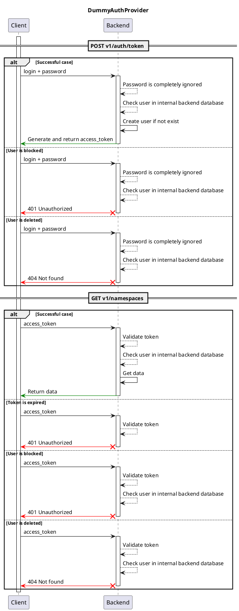

# Dummy Auth provider { #backend-auth-dummy }

## Description

This auth provider allows to sign-in with any username and password, and and then issues an access token.

After successful auth, username is saved to backend database. It is then used for creating audit records for any object change, see `changed_by` field.

## Interaction schema


<!--
```mermaid
sequenceDiagram
participant "Client"
participant "Backend"
activate "Client"
alt Successful case
"Client" ->> "Backend"  : login + password
"Backend" ->> "Backend" : Password is completely ignored
"Backend" ->> "Backend" : Check user in internal backend database
"Backend" ->> "Backend" : Create user if not exist
else
"Client" ->> "Backend"  : login + password
"Backend" ->> "Backend" : Password is completely ignored
"Backend" ->> "Backend" : Check user in internal backend database
else
"Client" ->> "Backend"  : login + password
"Backend" ->> "Backend" : Password is completely ignored
"Backend" ->> "Backend" : Check user in internal backend database
end
alt Successful case
"Client" ->> "Backend"  : access_token
"Backend" ->> "Backend" : Validate token
"Backend" ->> "Backend" : Check user in internal backend database
"Backend" ->> "Backend" : Get data
else
"Client" ->> "Backend"  : access_token
"Backend" ->> "Backend" : Validate token
else
"Client" ->> "Backend"  : access_token
"Backend" ->> "Backend" : Validate token
"Backend" ->> "Backend" : Check user in internal backend database
else
"Client" ->> "Backend"  : access_token
"Backend" ->> "Backend" : Validate token
"Backend" ->> "Backend" : Check user in internal backend database
end
deactivate "Client"
``` -->
## Configuration

::: horizon.backend.settings.auth.dummy.DummyAuthProviderSettings


::: horizon.backend.settings.auth.jwt.JWTSettings

