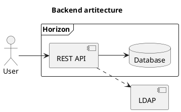
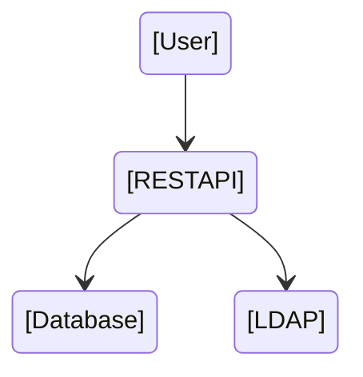

# Архитектура { #backend-architecture }

```plantuml

    @startuml
        title Backend artitecture
        skinparam linetype polyline
        left to right direction

        actor "User"

        frame "Horizon" {
            component "REST API"
            database "Database"
        }

        component "LDAP"

        [User] --> [REST API]
        [REST API] --> [Database]
        [REST API] ..> [LDAP]
    @enduml
```

```mermaid
stateDiagram-v2
[User] --> [RESTAPI]
[RESTAPI] --> [Database]
[RESTAPI] --> [LDAP]
```