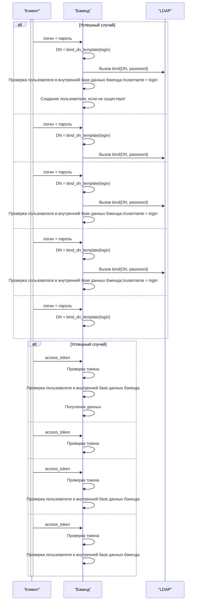
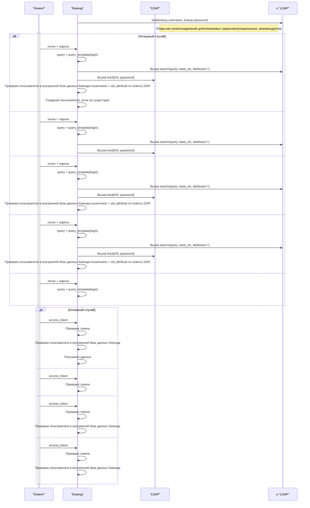

# Провайдер аутентификации LDAP { #backend-auth-ldap-cached }

## Описание

Этот провайдер аутентификации [LDAP Auth provider](ldap.md#backend-auth-ldap) проверяет учетные данные пользователя в LDAP, а затем выдает токен доступа.

Все запросы к бэкенду должны выполняться с передачей этого токена доступа. Если срок действия токена истек, необходимо запросить новый токен аутентификации.

После успешной аутентификации имя пользователя сохраняется в базе данных бэкенда. Затем оно используется для создания записей аудита при любом изменении объекта, см. поле `changed_by`.

#### ПРЕДУПРЕЖДЕНИЕ
Пока токен действителен, запросы к LDAP для проверки существования пользователя и его блокировки не выполняются.
Поэтому не устанавливайте слишком длительное время истечения срока действия токена доступа (например, больше дня).

## Стратегии

#### ПРИМЕЧАНИЕ
Базовая терминология LDAP объясняется здесь: [Обзор LDAP](https://www.zytrax.com/books/ldap/ch2/)

Существуют 2 стратегии проверки пользователя в LDAP:

- Попытка вызвать запрос `bind` в LDAP с `DN` (`DistinguishedName`) и паролем пользователя. `DN` генерируется с использованием [bind_dn_template](#horizon.backend.settings.auth.ldap.LDAPSettings.bind_dn_template)
- Сначала попытка *поиска* пользователя (запрос `search`) в LDAP для получения `DN` пользователя с помощью некоторого запроса, а затем попытка вызвать `bind` с использованием этого `DN`. См. [настройки поиска](#horizon.backend.settings.auth.ldap.LDAPSettings.lookup)

По умолчанию используется **стратегия поиска**, так как она может найти пользователя в сложной среде LDAP/ActiveDirectory. Например:

- вы можете искать пользователя по `uid`, например, `(uid={login})` или `(sAMAccountName={login})`
- вы можете искать пользователя по нескольким атрибутам, например, `(|(uid={login})(mail={login}@domain.com))`
- вы можете фильтровать записи, например, `(&(uid={login})(objectClass=person)`
- вы можете фильтровать пользователей, соответствующих определенной группе или другому условию, например, `(&(uid={login})(memberOf=cn=MyPrettyGroup,ou=Groups,dc=mycompany,dc=com))`

После того как пользователь найден в LDAP, его [uid_attribute](#horizon.backend.settings.auth.ldap.LDAPSettings.uid_attribute) используется для записей аудита.

## Схема взаимодействия

```plantuml

        @startuml
            title LDAPAuthProvider (без поиска)
            participant "Клиент"
            participant "Бэкенд"
            participant "LDAP"

            == POST v1/auth/token ==

            activate "Клиент"
            alt Успешный случай
                "Клиент" -> "Бэкенд" ++ : логин + пароль
                "Бэкенд" --> "Бэкенд" : DN = bind_dn_template(login)
                "Бэкенд" -> "LDAP" ++ : Вызов bind(DN, password)
                "LDAP" --[#green]> "Бэкенд" -- : Успешно
                "Бэкенд" --> "Бэкенд" : Проверка пользователя в внутренней базе данных бэкенда,\nusername = login
                "Бэкенд" -> "Бэкенд" : Создание пользователя, если не существует
                "Бэкенд" -[#green]> "Клиент" -- : Генерация и возврат access_token

            else Неверные учетные данные | Пользователь заблокирован в LDAP
                "Клиент" -> "Бэкенд" ++ : логин + пароль
                "Бэкенд" --> "Бэкенд" : DN = bind_dn_template(login)
                "Бэкенд" -> "LDAP" ++ : Вызов bind(DN, password)
                "LDAP" x-[#red]> "Бэкенд" -- : Ошибка связывания
                "Бэкенд" x-[#red]> "Клиент" -- : 401 Неавторизован

            else Пользователь заблокирован в внутренней базе данных бэкенда
                "Клиент" -> "Бэкенд" ++ : логин + пароль
                "Бэкенд" --> "Бэкенд" : DN = bind_dn_template(login)
                "Бэкенд" -> "LDAP" ++ : Вызов bind(DN, password)
                "LDAP" --[#green]> "Бэкенд" -- : Успешно
                "Бэкенд" --> "Бэкенд" : Проверка пользователя в внутренней базе данных бэкенда,\nusername = login
                "Бэкенд" x-[#red]> "Клиент" -- : 404 Не найден

            else Пользователь удален в внутренней базе данных бэкенда
                "Клиент" -> "Бэкенд" ++ : логин + пароль
                "Бэкенд" --> "Бэкенд" : DN = bind_dn_template(login)
                "Бэкенд" -> "LDAP" ++ : Вызов bind(DN, password)
                "LDAP" --[#green]> "Бэкенд" -- : Возврат информации о пользователе
                "Бэкенд" --> "Бэкенд" : Проверка пользователя в внутренней базе данных бэкенда,\nusername = login
                "Бэкенд" x-[#red]> "Клиент" -- : 404 Не найден

            else LDAP недоступен
                "Клиент" -> "Бэкенд" ++ : логин + пароль
                "Бэкенд" --> "Бэкенд" : DN = bind_dn_template(login)
                "Бэкенд" -[#red]>x "LDAP" : Вызов bind(DN, password)
                "Бэкенд" x-[#red]> "Клиент" -- : 503 Сервис недоступен
            end

            == GET v1/namespaces ==

            alt Успешный случай
                "Клиент" -> "Бэкенд" ++ : access_token
                "Бэкенд" --> "Бэкенд" : Проверка токена
                "Бэкенд" --> "Бэкенд" : Проверка пользователя в внутренней базе данных бэкенда
                "Бэкенд" -> "Бэкенд" : Получение данных
                "Бэкенд" -[#green]> "Клиент" -- : Возврат данных

            else Срок действия токена истек
                "Клиент" -> "Бэкенд" ++ : access_token
                "Бэкенд" --> "Бэкенд" : Проверка токена
                "Бэкенд" x-[#red]> "Клиент" -- : 401 Неавторизован

            else Пользователь заблокирован
                "Клиент" -> "Бэкенд" ++ : access_token
                "Бэкенд" --> "Бэкенд" : Проверка токена
                "Бэкенд" --> "Бэкенд" : Проверка пользователя в внутренней базе данных бэкенда
                "Бэкенд" x-[#red]> "Клиент" -- : 401 Неавторизован

            else Пользователь удален
                "Клиент" -> "Бэкенд" ++ : access_token
                "Бэкенд" --> "Бэкенд" : Проверка токена
                "Бэкенд" --> "Бэкенд" : Проверка пользователя в внутренней базе данных бэкенда
                "Бэкенд" x-[#red]> "Клиент" -- : 404 Не найден
            end

            deactivate "Клиент"
        @enduml
```

```plantuml

        @startuml
            title LDAPAuthProvider (с поиском)
            participant "Клиент"
            participant "Бэкенд"
            participant "LDAP"

            == Запуск бэкенда ==

            "Бэкенд" ->o "LDAP" ++ : bind(lookup.username, lookup.password)
            note right of "LDAP" : Открытие пула\nсоединений для\nпоисковых запросов\n(опционально, рекомендуется)

            == POST v1/auth/token ==

            activate "Клиент"
            alt Успешный случай
                "Клиент" -> "Бэкенд" ++ : логин + пароль
                "Бэкенд" --> "Бэкенд" : query = query_template(login)
                "Бэкенд" ->o "LDAP" : Вызов search(query, base_dn, attributes=*)
                "LDAP" --[#green]> "Бэкенд" : Возврат DN пользователя и uid_attribute
                "Бэкенд" -> "LDAP" ++ : Вызов bind(DN, password)
                "LDAP" --[#green]> "Бэкенд" -- : Успешно
                "Бэкенд" --> "Бэкенд" : Проверка пользователя в внутренней базе данных бэкенда,\nusername = uid_attribute из ответа LDAP
                "Бэкенд" -> "Бэкенд" : Создание пользователя, если не существует
                "Бэкенд" -[#green]> "Клиент" -- : Генерация и возврат access_token

            else Неверные учетные данные | Пользователь заблокирован в LDAP
                "Клиент" -> "Бэкенд" ++ : логин + пароль
                "Бэкенд" --> "Бэкенд" : query = query_template(login)
                "Бэкенд" ->o "LDAP" : Вызов search(query, base_dn, attributes=*)
                "LDAP" --[#green]> "Бэкенд" : Возврат DN пользователя и uid_attribute
                "Бэкенд" -> "LDAP" ++ : Вызов bind(DN, password)
                "LDAP" x--[#red]> "Бэкенд" -- : Ошибка связывания
                "Бэкенд" x-[#red]> "Клиент" -- : 401 Неавторизован

            else Пользователь заблокирован в внутренней базе данных бэкенда
                "Клиент" -> "Бэкенд" ++ : логин + пароль
                "Бэкенд" --> "Бэкенд" : query = query_template(login)
                "Бэкенд" ->o "LDAP" : Вызов search(query, base_dn, attributes=*)
                "LDAP" --[#green]> "Бэкенд" : Возврат DN пользователя и uid_attribute
                "Бэкенд" -> "LDAP" ++ : Вызов bind(DN, password)
                "LDAP" --[#green]> "Бэкенд" -- : Успешно
                "Бэкенд" --> "Бэкенд" : Проверка пользователя в внутренней базе данных бэкенда,\nusername = uid_attribute из ответа LDAP
                "Бэкенд" x-[#red]> "Клиент" -- : 404 Не найден

            else Пользователь удален в внутренней базе данных бэкенда
                "Клиент" -> "Бэкенд" ++ : логин + пароль
                "Бэкенд" --> "Бэкенд" : query = query_template(login)
                "Бэкенд" ->o "LDAP" : Вызов search(query, base_dn, attributes=*)
                "LDAP" --[#green]> "Бэкенд" : Возврат DN пользователя и uid_attribute
                "Бэкенд" -> "LDAP" ++ : Вызов bind(DN, password)
                "LDAP" --[#green]> "Бэкенд" -- : Успешно
                "Бэкенд" --> "Бэкенд" : Проверка пользователя в внутренней базе данных бэкенда,\nusername = uid_attribute из ответа LDAP
                "Бэкенд" x-[#red]> "Клиент" -- : 404 Не найден

            else LDAP недоступен
                "Клиент" -> "Бэкенд" ++ : логин + пароль
                "Бэкенд" --> "Бэкенд" : query = query_template(login)
                "Бэкенд" -[#red]>x "LDAP" : Вызов search(query, base_dn, attributes=*)
                "Бэкенд" x-[#red]> "Клиент" -- : 503 Сервис недоступен
            end

            == GET v1/namespaces ==

            alt Успешный случай
                "Клиент" -> "Бэкенд" ++ : access_token
                "Бэкенд" --> "Бэкенд" : Проверка токена
                "Бэкенд" --> "Бэкенд" : Проверка пользователя в внутренней базе данных бэкенда
                "Бэкенд" -> "Бэкенд" : Получение данных
                "Бэкенд" -[#green]> "Клиент" -- : Возврат данных

            else Срок действия токена истек
                "Клиент" -> "Бэкенд" ++ : access_token
                "Бэкенд" --> "Бэкенд" : Проверка токена
                "Бэкенд" x-[#red]> "Клиент" -- : 401 Неавторизован

            else Пользователь заблокирован
                "Клиент" -> "Бэкенд" ++ : access_token
                "Бэкенд" --> "Бэкенд" : Проверка токена
                "Бэкенд" --> "Бэкенд" : Проверка пользователя в внутренней базе данных бэкенда
                "Бэкенд" x-[#red]> "Клиент" -- : 401 Неавторизован

            else Пользователь удален
                "Клиент" -> "Бэкенд" ++ : access_token
                "Бэкенд" --> "Бэкенд" : Проверка токена
                "Бэкенд" --> "Бэкенд" : Проверка пользователя в внутренней базе данных бэкенда
                "Бэкенд" x-[#red]> "Клиент" -- : 404 Не найден
            end

            deactivate "Клиент"
        @enduml
```

## Базовая конфигурация

::: horizon.backend.settings.auth.ldap.LDAPAuthProviderSettings

::: horizon.backend.settings.auth.ldap.LDAPSettings

::: horizon.backend.settings.auth.jwt.JWTSettings

::: horizon.backend.settings.auth.ldap.LDAPConnectionPoolSettings

## Конфигурация, связанная с поиском

::: horizon.backend.settings.auth.ldap.LDAPLookupSettings

::: horizon.backend.settings.auth.ldap.LDAPCredentials

